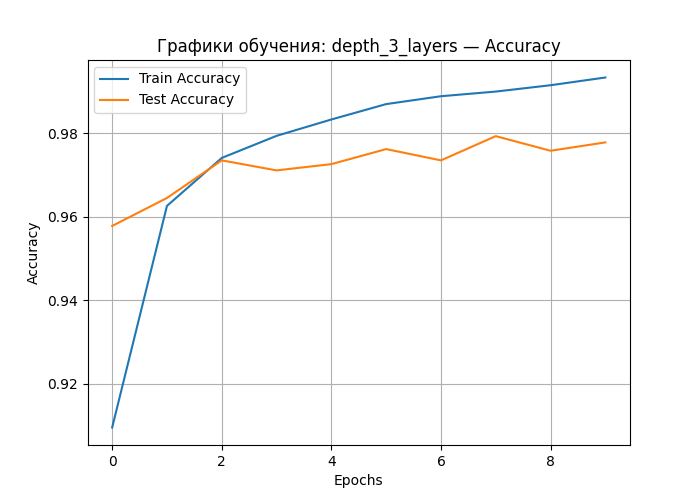
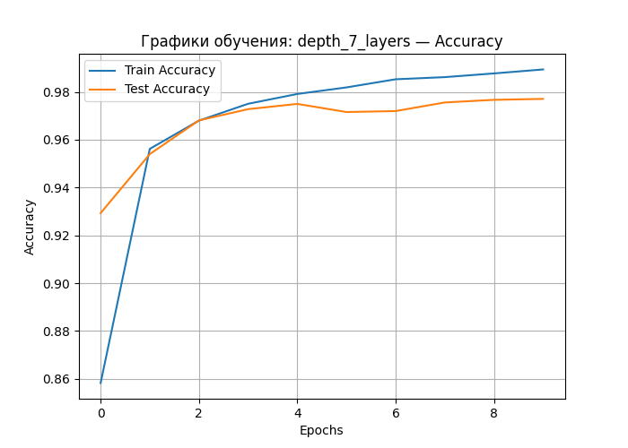
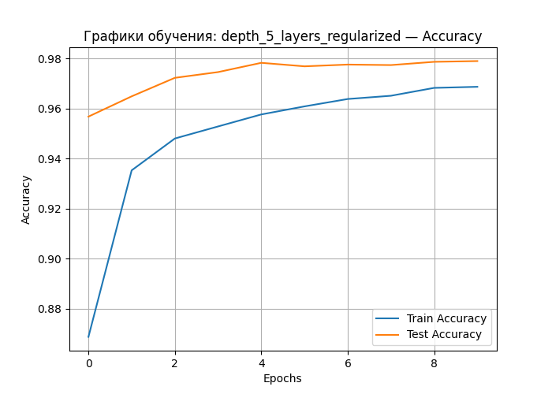
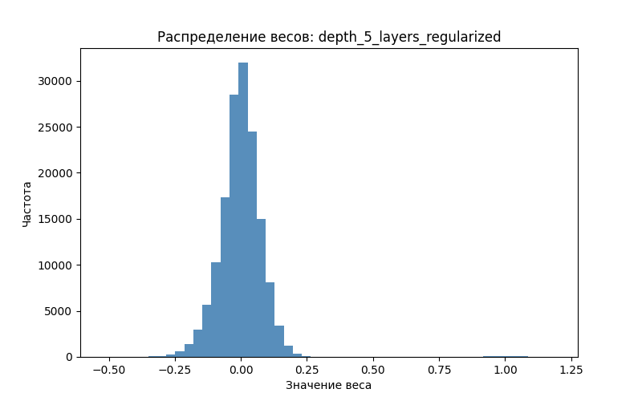
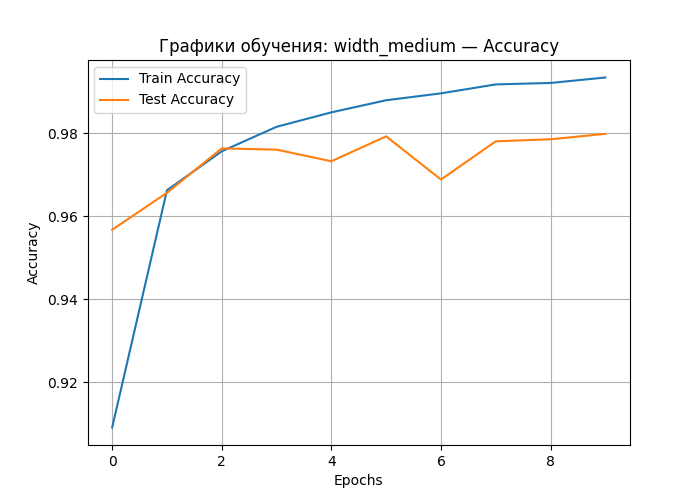
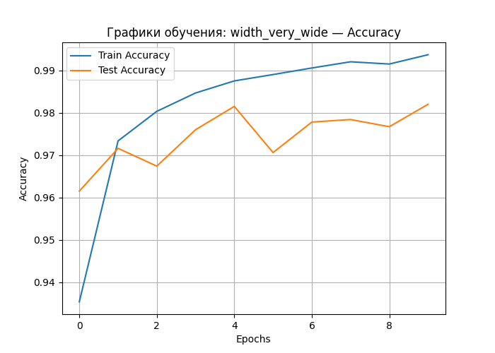
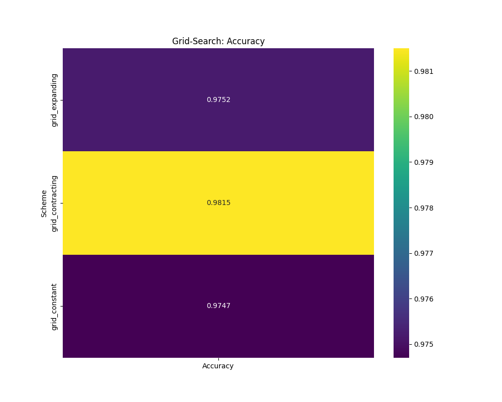
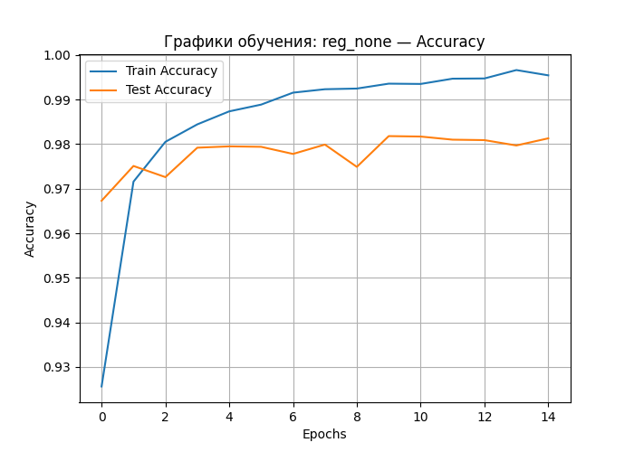
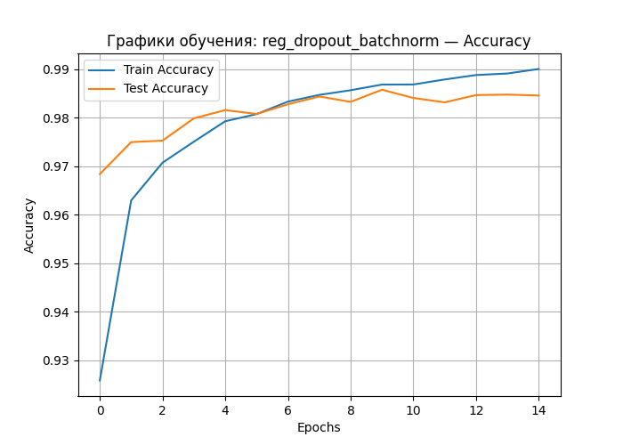

* JSON-файл с историей обучния — `results/<experiment_type>/<model>_results.json`  
* кривые потерь / точности — `plots/<experiment_type>/<model>_loss.png`, `…_accuracy.png`  
* гистограмма весов — `plots/<experiment_type>/<model>_weights_hist.png`

Логи выводились через 'logging', для упрощения анализа временных меток и гиперпараметров.

## 2. Depth experiments (`homework_depth_experiments.py`)

| Model | Test accuracy | Params |
|-------|--------------|--------|
| depth_1_layer | 92.14 % | 7 850 |
| depth_3_layers | 97.78 % | 118 282 |
| depth_5_layers_regularized | **97.90 %** | 152 074 |

**Лучший результат:** `depth_5_layers_regularized` — комбинация глубокой сети с BatchNorm + Dropout позволила немного превзойти «чистые» 3–7 слоя.

### Аналитика и графики(Depth)

Оптимальная глубина: наилучшая точность (97.78 %) достигнута у модели **depth_3_layers**. Дальнейшее увеличение глубины без регуляризации не дало прироста, а в случае 7-слойной сети начало проявляться переобучение.

Переобучение: чем глубже модель, тем больше разрыв между train и test accuracy — особенно заметно для **depth_7_layers**. На графиках ниже кривая test accuracy поднимается медленнее.

Регуляризация: добавление BatchNorm + Dropout в 5-слойную сеть (**depth_5_layers_regularized**) сократило разрыв и улучшило итоговую точность по сравнению с «грязной» 5-слойной.

| depth_3_layers_learning_curves_accuracy.png | depth_7_layers_learning_curves_accuracy.png | depth_5_layers_regularized_learning_curves_accuracy.png |
| :--: | :--: | :--: |
|  |  |  |

Дополнительно — пример распределения весов для лучшей модели:

## 3. Width experiments (`homework_width_experiments.py`)

| Model | Test accuracy | Params |
|-------|--------------|--------|
| width_narrow | 96.96 % | 53 018 |
| width_medium | 97.99 % | 242 762 |
| width_very_wide | **98.20 %** | 4 235 786 |

`width_very_wide` даёт лучший accuracy, но цена — ×80 больше параметров по сравнению с `width_narrow`.

### Аналитика и графики (Width)

Точность vs Затраты: увеличение ширины слоёв улучшает accuracy, но приводит к экспоненциальному росту числа параметров и времени обучения (см. таблицу выше). Максимальная модель **width_very_wide** показала 98.20 %, однако весит 4.2 M параметров.

 результаты grid-search (heatmap ниже) демонстрируют, что expanding/contracting/constant дают сходные показатели ≈97.9 %, т.е. общая «мощность» сети важнее конкретного распределения ширины.

| width_medium_learning_curves_accuracy.png | width_very_wide_learning_curves_accuracy.png |
| :--: | :--: |
|  |  |

| Grid-search heatmap |
| :--: |
|  |

## 4. Regularisation experiments (`homework_regularization_experiments.py`)

| Model | Test accuracy |
|-------|--------------|
| reg_none | 98.13 % |
| reg_batchnorm | 98.27 % |
| reg_dropout_batchnorm | **98.46 %** |
| reg_l2 | 97.90 % |
| reg_dropout_variable | 98.08 % |

**Вывод:** комбинация Dropout 0.3 + BatchNorm (`reg_dropout_batchnorm`) — наиболее
эффективный способ борьбы с переобучением в данном случае.

| reg_none_learning_curves_accuracy.png | reg_dropout_batchnorm_learning_curves_accuracy.png |
| :--: | :--: |
|  |  |

## 5. Лучшие модели по экспериментам

| Experiment | Best model | Accuracy |
|------------|-----------|----------|
| Depth | depth_5_layers_regularized | 97.90 % |
| Width | width_very_wide | 98.20 % |
| Regularisation | reg_dropout_batchnorm | **98.46 %** |

## 6. Общие выводы

* Переход от 1-слойной линейной модели к 3-слойной сети даёт резкий прирост качества; далее добавление слоёв приносит лишь минимальное повышение метрик и повышает риск переобучения.
* Увеличение числа нейронов почти всегда повышает точность, но «цена» — квадратичный рост параметров и времени обучения. В реальных проектах требуется баланс между ресурсами и желаемым accuracy.
* Самый большой вклад в устойчивость и итоговую точность даёт грамотная регуляризация (BatchNorm + Dropout).  
* Гистограммы весов показывают: после BatchNorm распределение смещается к сужению, Dropout сглаживает "хвосты"
