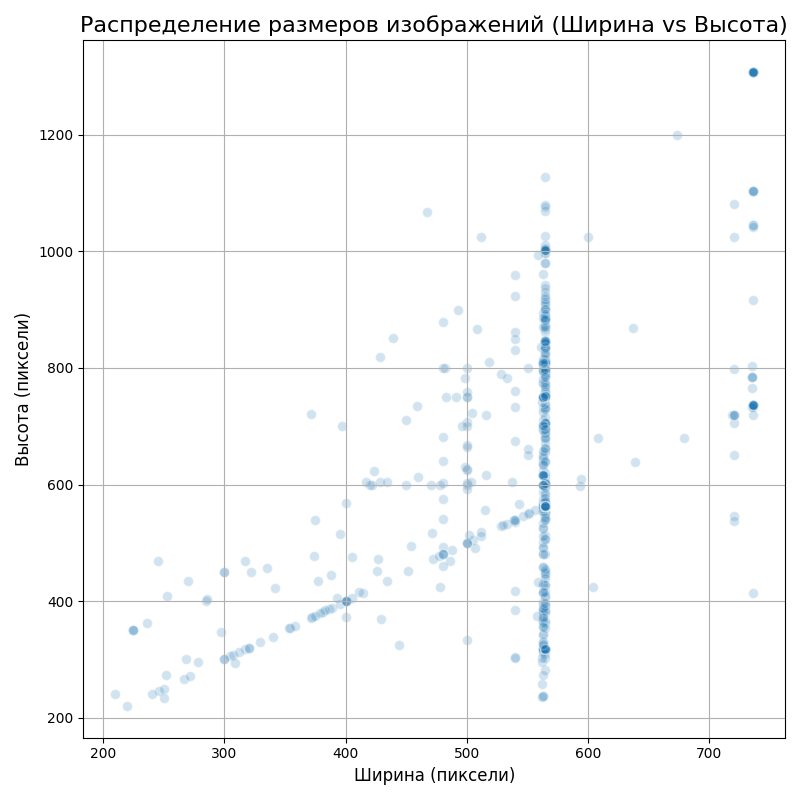

# Отчет по домашнему заданию
---

В данной работе мы провели исследование техник аугментации изображений и выполнили дообучение предобученной сверточной нейронной сети. Все эксперименты проводились в среде Jupyter Notebook для наглядности и воспроизводимости результатов.

## Задание 1: Стандартные аугментации torchvision
**Что было сделано:**
- Из датасета были выбраны 5 изображений, представляющих разные классы.
- Для каждого изображения был продемонстрирован результат применения пяти стандартных аугментаций:
  - Горизонтальное отражение (RandomHorizontalFlip)
  - Случайная обрезка с заполнением (RandomCrop)
  - Изменение цветовых характеристик (ColorJitter)
  - Случайный поворот (RandomRotation)
  - Преобразование в оттенки серого (RandomGrayscale)

**Результаты:**
На примере класса "Гароу" можно увидеть, как меняется изображение после каждой трансформации:

- Горизонтальное отражение
  
- Случайная обрезка
  
- Изменение цвета
  
- Случайный поворот
  
- Преобразование в оттенки серого
  
- Всё вместе
  ![results/task1_Генос_combo.png]

**Выводы:**
- Аугментации позволяют значительно увеличить разнообразие данных, не собирая новые изображения вручную.
- Даже простые трансформации, такие как отражение или поворот, могут создавать для модели новые, сложные примеры, помогая ей лучше обобщать и избегать переобучения.
- Комбинирование аугментаций является мощным инструментом для генерации сложных и реалистичных вариаций данных.

---

## Задание 2: Кастомные аугментации

**Что было сделано:**
- Были реализованы три класса аугментаций, работающих с объектами PIL.Image: RandomGaussianBlur, RandomContrast, RandomBrightness.
- Проведено визуальное сравнение работы RandomGaussianBlur и AddGaussianNoise

**Результаты:**

- Сравнение размытия и шума:
  
- Сравнение контраста и яркости:
  

**Выводы:**
- Реализация собственных аугментаций в стиле torchvision является простой задачей
- Кастомные аугментации вносят заметные изменения в изображения.

---

## Задание 3: Анализ датасета

**Что было сделано:**
- Написан скрипт, который проходится по всем изображениям в папке train.
- Подсчитано общее количество изображений и их распределение по классам. (
- Определены минимальный, максимальный и средний размеры изображений.
- Построены гистограмма распределения по классам и диаграмма рассеяния для размеров.

**Результаты:**
- Всего изображений: 780
- Минимальный размер: (210, 220)
- Максимальный размер: (736, 1308)
- Средний размер: (545, 629)

- Распределение по классам:
  
- Распределение по размерам:
  

**Выводы:**
- -30 изображений для каждого класса на train и 100 на test.
- странно, что в тесте данных в 3× больше, чем в обучении

---

## Задание 4: Pipeline аугментаций

**Что было сделано:**
- Реализован класс AugmentationPipeline с методами add_augmentation, remove_augmentation и apply.
- Продемонстрирована работа пайплайна на примерах "Light", "Medium" и "Heavy" конфигураций

**Результаты:**
| Light (только отражение) | Medium (+ изменение цвета) | Heavy (+ поворот и размытие) | удаление'rotation' и 'blur' |
| :---: | :---: | :---: | :---: |
|  |    |    |  |

**Выводы:**
- Созданный класс позволяет динамически формировать пайплайн аугментаций, что может быть удобно для экспериментов и подбора оптимальной стратегии аугментации

---

## Задание 5: Эксперимент с размерами изображений
**Цель:** Оценить, как размер входных изображений влияет на время обработки и потребление памяти.

**Что было сделано:**
- Для 100 изображений применялся "тяжелый" пайплайн аугментаций.
- Эксперимент был повторен для изображений размером 64x64, 128x128, 224x224 и 512x512.
- Измерены общее время выполнения и дельта потребления оперативной памяти.

**Результаты:**

**Выводы:**
- Зависимость времени выполнения и потребления памяти от размера изображения является нелинейной (близкой к квадратичной), так как количество пикселей растет пропорционально квадрату стороны.
- Увеличение размера с 224x224 до 512x512 приводит к росту потребления ресурсов. Необходимо искать баланс между качеством (больше деталей в крупных изображениях) и доступными вычислительными ресурсами.

---

## Задание 6: Дообучение предобученной модели
**Цель:** Дообучить предобученную модель на нааших данных

**Что было сделано:**
- Взята модель ResNet-18, предобученная на датасете ImageNet.
- Последний полносвязный слой был заменен на новый, с количеством выходов, равным числу классов в нашем датасете.
- Модель была дообучена в течение 10 эпох

**Результаты:**

**Выводы:**
- Эффективность: Даже за 10 эпох обучения только одного слоя модель достигла неплохой точности.
- Скорость и экономия ресурсов: Дообучение предобученной модели — это достаточно быстрый и нетребовательный к ресурсам процесс по сравнению с обучением всей сети с нуля.

---

## Итоговый вывод по работе
В ходе выполнения данного домашнего задания освоил ключевые техники работы с изображениями в задачах глубокого обучения, изучил стандартные аугментации torchvision, научился создавать кастомные аугментации, познакомился с техниками увеличения датасета.
убедился, что даже простые стандартные и кастомные аугментации существенно увеличивают разнообразие обучающих данных. Было наглядно показано, что увеличение размера изображений приводит к существенному росту времени обработки и потребления памяти, поэтому важно находить баланс между качеством входных данных и доступными ресурсами.
Дообучил предобученную модель на данном датасете.
