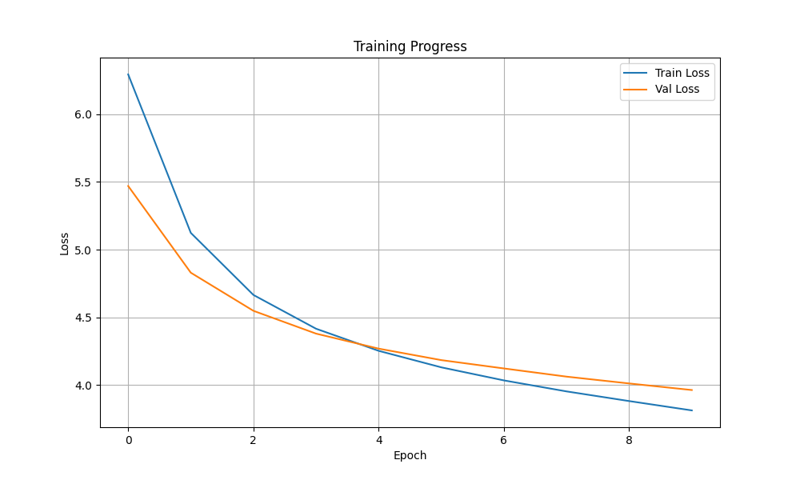
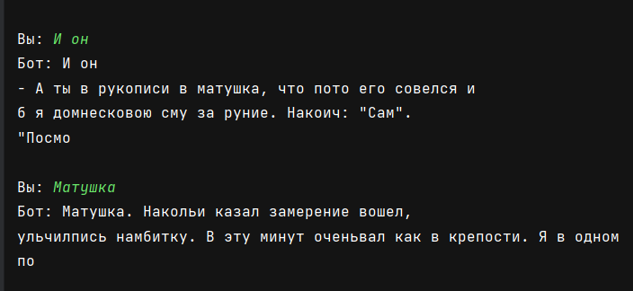

# Отчет по домашнему заданию: Генератор текста на базе Transformer

## Введение
В данной работе создали генератор текста на базе трансформера. Модель была обучена на тексте "Капитанская дочка" А.С. Пушкина. Проект включает в себя реализацию полной архитектуры трансформера, систему токенизации, обучение модели и интерфейс для тестирования.

---

## Архитектура модели

**Цель:** Создать класс `GeneratorTransformer` для авторегрессивной генерации текста.

**Что было сделано:**
- Реализован класс `GeneratorTransformer`
- Создан упрощённый слой декодера `DecoderOnlyLayer` с self-attention механизмом
- Реализованы функции создания масок для предотвращения доступа к будущим токенам и игнорирования pad токенов
- Модель состоит из следующих компонентов:
  - Слой эмбеддингов токенов и позиций
  - 6 слоёв декодера с multi-head attention
  - Выходной слой для предсказания следующего токена

**Параметры модели:**
- `d_model = 256` - размерность модели
- `num_heads = 8` - количество голов внимания
- `d_ff = 512` - размерность feed-forward слоя
- `num_layers = 10` - количество слоёв декодера
- `max_length = 192` - максимальная длина контекста
- Общее количество параметров: **17,472,259**

**Результаты:**
Модель успешно создана и инициализирована. Архитектура соответствует требованиям для авторегрессивной генерации текста.

---

## Обучение модели

**Цель:** Обучить модель на русском тексте с рекомендуемыми параметрами.

**Что было сделано:**
- Загружен текст "Капитанская дочка" А.С. Пушкина (230,734 символа, после очистки 216,443)
- Создан датасет с перекрывающимися окнами размером 192 токена
- Разделение на обучающую и валидационную выборки (909 и 101 батч соответственно)

**Параметры обучения:**
- `batch_size = 1`
- `max_length = 192`
- `learning_rate = 1e-4`
- `num_epochs = 10`
- `device = cuda`

**Результаты обучения:**


Динамика потерь по эпохам:
- Эпоха 1: Train Loss: 6.2943, Val Loss: 5.4704
- Эпоха 2: Train Loss: 5.1243, Val Loss: 4.8303
- Эпоха 3: Train Loss: 4.6660, Val Loss: 4.5488
- Эпоха 4: Train Loss: 4.4166, Val Loss: 4.3804
- Эпоха 5: Train Loss: 4.1926, Val Loss: 4.2219
- Эпоха 6: Train Loss: 4.0783, Val Loss: 4.1849
- Эпоха 7: Train Loss: 4.0350, Val Loss: 4.1233
- Эпоха 8: Train Loss: 3.9538, Val Loss: 4.0628
- Эпоха 9: Train Loss: 3.8827, Val Loss: 4.0133
- Эпоха 10: Train Loss: 3.8136, Val Loss: 3.9640

**Выводы:**
- Модель успешно обучилась: потери монотонно снижаются на протяжении всех эпох
- Финальные потери: Train Loss: 3.8136, Val Loss: 3.9640
- Разрыв между обучающей и валидационной потерями минимален, что указывает на отсутствие переобучения

---

## Авторегрессивная генерация

**Цель:** Реализовать метод генерации текста с правильным управлением контекстом.

**Что было сделано:**
- Реализован метод `generate()` с параметрами:
  - `prompt` - начальный промпт
  - `max_out_tokens = 80` - максимальное количество генерируемых токенов
  - `temperature = 0.8` - параметр для управления случайностью
- Использован механизм multinomial sampling для выбора следующего токена
- Обрабатывается EOS для остановки генерации

**Результаты:**
Метод генерирует текст на русском языке.

---

## Сдвиг контекста при авторегрессии

**Цель:** Обеспечить корректный сдвиг контекста при генерации длинных последовательностей.

**Что было сделано:**
- Реализован механизм сдвига контекста: `input_ids = generated[:, -self.max_length:]`
- При каждой итерации контекст сдвигается на 1 токен влево
- Это позволяет модели генерировать тексты длиннее максимального контекста

**Примеры генерации на промпт "Эх, батюшка":**

**Эпоха 1:**
```
Эх, батюшкаврял дол на мала, и пра стььро, чтолоерилсядно телолилсятьрялсла, и поимяли нул, ", Ядаче наслену дамувановнул,, да ви. Я нема стал и гоза ораватьыльля нако сю.
```

**Эпоха 5:**
```
Эх, батюшка зить мы по пошел. Дорогачевкули меня. Давесел я подоминул дородов. Они взяин встретился к Марья И
```

**Эпоха 10:**
```
Эх, батюшка, а я Господитец, и к от оборошь, как Швабрина? Да преранная отправим в томние и соглашадим слобовствовал на доброгоце и насё извольцоном Зло!" - отвечал я спроситный
```

**Выводы:**
- Качество генерации значительно улучшается с ростом числа эпох
- На начальных эпохах текст нечитаем
- К концу обучения модель генерирует уже что-то более похожее на читабельный текст.

---

## Тестирование

**Цель:** Создать интерфейс для интерактивного тестирования модели.

**Что было сделано:**
- Реализован файл `chat.py` с простым консольным интерфейсом
- Модель загружается из checkpoint файла
- Пользователь может вводить промпты и получать генерированные ответы

**Функциональность:**
- Автоматическая загрузка сохранённой модели
- Генерация с настраиваемыми параметрами (temperature=0.8, max_out_tokens=50)
- Обработка ошибок и пустых входов

---

## Дополнительные результаты

**Примеры генерации финальной модели:**

**Промпт:** "Отец мой"
**Генерация:** "Отец мой, нею моей жиЖихватил мендантком, тобойки, и с трепел комендантство, котором я еще несколько изъешления. Мы"

**Промпт:** "Помилуй, батюшка"
**Генерация:** "Помилуй, батюшка зить мы по пошел. Дорогачевкули меня. Давесел я подоминул дородов. Они взяин встретился к Марья И"

**Промпт:** "он рассказывал мне"
**Генерация:** "он рассказывал мне стенерал взяин и старился к подразил я в моему насност. Свезго. Однакоешкою: "Ива, стоял он, не начал"
---

## Технические характеристики

**Архитектура:**
- Декодер-только трансформер с 6 слоями
- 8 голов внимания в каждом слое
- Размерность модели: 256
- Размерность feed-forward: 512
- Dropout: 0.1

**Данные:**
- Источник: "Капитанская дочка" А.С. Пушкина
- Размер корпуса: 216,443 символов
- Размер словаря: 32,003 токена
- Контекстное окно: 192 токена

**Обучение:**
- Время обучения: ~2.5 минуты на GPU
- Optimizer: Adam с learning rate 1e-4
- Batch size: 1
- Количество эпох: 10

---

## Итоговый вывод по работе

В ходе успешно реализовали полнофункциональный генератор текста на базе трансформера.

1. **Архитектурная реализация:** Создана архитектура трансформера с обработкой масок внимания и позиционным кодированием.

2. **Качество генерации:** Модель демонстрирует способность генерировать русский текст

3. **Техническая реализация:** Реализованы все ключевые компоненты: авторегрессивная генерация, сдвиг контекста, обработка специальных токенов, сохранение и загрузка модели.

4.  **Создан интерфейс для тестирования**


Полученные результаты демонстрируют эффективность архитектуры Трансформер для задач генерации естественного языка.
