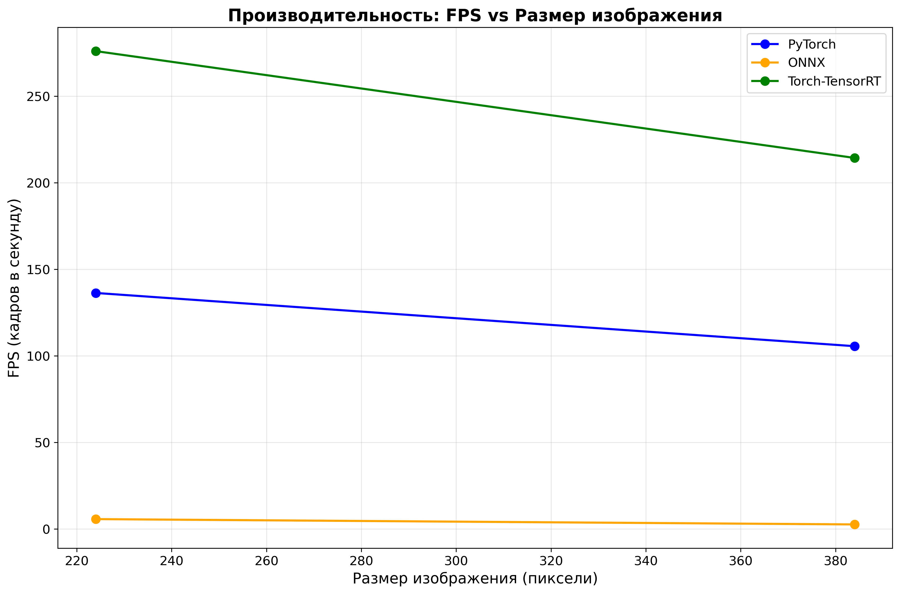
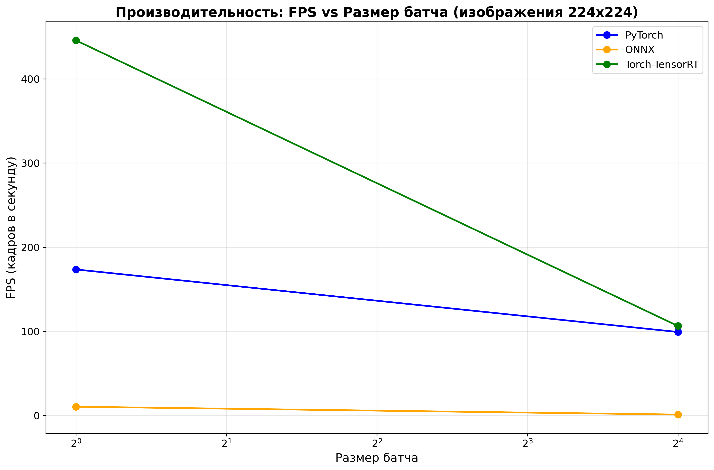
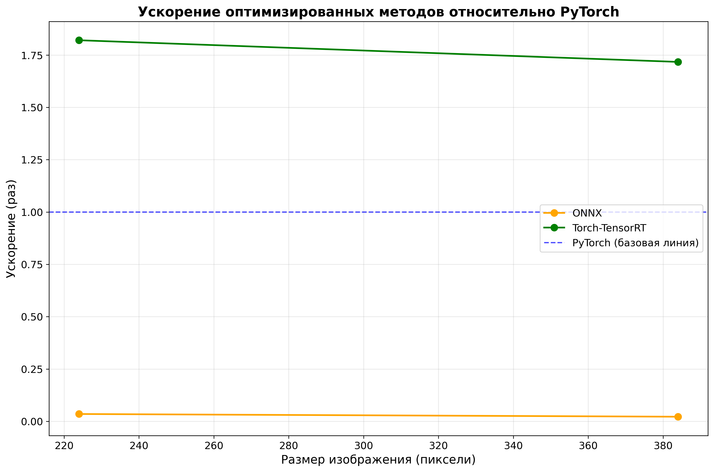
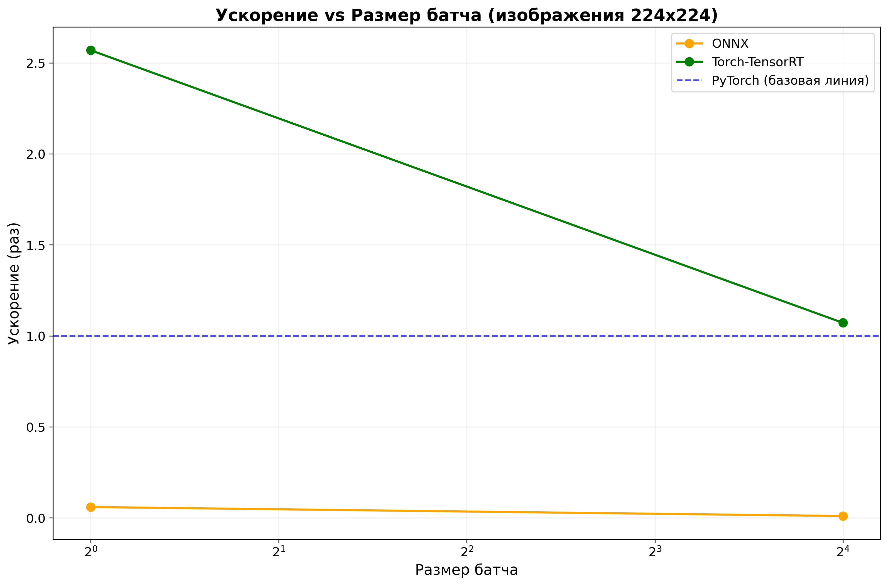

# Отчет по домашнему заданию: Оптимизация инференса и перенос моделей

## Введение
В данной работе исследовали оптимизацию инференса нейронных сетей и перенос моделей на различные платформы. Основная цель - сравнить производительность PyTorch моделей с их оптимизированными версиями в форматах ONNX и TensorRT на примере классификации изображений.

Проект включает в себя:
- Обучение ResNet-18 для разных размеров входных изображений
- Конвертацию моделей в ONNX и TensorRT форматы
- Тестирование производительности
- Анализ влияния размера батча и изображений на скорость инференса

---

## Архитектура и датасет

**Модель:** ResNet-18 с модификациями:
- Количество классов: 6 (аниме персонажи)
- Входные размеры: 224×224, 256×256, 384×384, 512×512 пикселей
- Архитектура: стандартная ResNet-18 с адаптированным классификатором

**Датасет:**
- **Классы:** Гароу, Генос, Сайтама, Соник, Татсумаки, Фубуки
- **Размер обучающей выборки:** 30 изображений на класс (180 всего)
- **Размер тестовой выборки:** 100 изображений на класс (600 всего)
- **Предобработка:** изменение размера, нормализация ImageNet

**Платформы для оптимизации:**
1. **PyTorch** - базовая реализация
2. **ONNX Runtime** - кроссплатформенный инференс
3. **TensorRT** - NVIDIA GPU оптимизация
---

## Обучение моделей

**Цель:** Обучить модели для разных размеров входных изображений.

**Параметры обучения:**
- `learning_rate = 0.001`
- `batch_size = 8`
- `num_epochs = 10`
- `optimizer = Adam`
- `device = CUDA`

**Результаты обучения по размерам:**

| Размер изображения | Лучшая точность | Время обучения |
|--------------------|-----------------|----------------|
| 224×224           | 79.50%          | ~21 сек        |
| 256×256           | 80.50%          | ~22 сек        |
| 384×384           | 84.83%          | ~38 сек        |
| 512×512           | 79.33%          | ~60 сек        |

**Выводы по обучению:**
- Лучший результат показал размер 384×384 с точностью 84.83%
- Время обучения растет квадратично с увеличением размера изображения
- Все модели достигли приемлемого качества классификации

---

## Конвертация моделей

**Цель:** Конвертировать обученные PyTorch модели в ONNX и TensorRT форматы.

**ONNX конвертация:**
- Использован стандартный экспорт PyTorch → ONNX
- Поддержка динамических размеров батча
- Оптимизация для GPU инференса

**TensorRT конвертация:**
- Torch-TensorRT компиляция напрямую из PyTorch
- FP32 precision
- Оптимизация для RTX 3060 Laptop GPU

**Размеры файлов:**
- PyTorch (.pth): ~43 MB
- ONNX (.onnx): ~43 MB  
- TensorRT (.trt): 33-62 MB (зависит от размера)

---

## Тест производительности

**Цель:** Провести комплексное сравнение производительности всех форматов моделей.

**Параметры тестирования:**
- **Размеры изображений:** 224×224, 256×256, 384×384, 512×512
- **Размеры батчей:** 1, 2, 4, 8, 16, 32, 64
- **Метрики:** время инференса (мс), FPS, использование памяти (MB)

**Аппаратная конфигурация:**
- **GPU:** NVIDIA GeForce RTX 3060 Laptop GPU
- **Память GPU:** 6.0 GB
- **CUDA версия:** 12.8

---

## Результаты бенчмарков

### Краткие выводы:
-  **TensorRT** - лучшая производительность (ускорение до 2.57x)
-  **PyTorch** - стабильная baseline производительность 
-  **ONNX** - неудовлетворительная производительность (замедление в 10-100x)

### Основные результаты (384×384, batch=16):

| Платформа | Время (мс) | FPS | Память (MB) | Ускорение |
|-----------|------------|-----|-------------|-----------|
| PyTorch   | 25.53      | 39.17 | 386.57    | 1.00x     |
| ONNX      | 1441.18    | 0.69  | 28.00     | 0.02x     |
| TensorRT  | 20.93      | 47.78 | 155.57    | 1.22x     |

### Результаты для размера 224×224:

| Размер батча | PyTorch (мс) | ONNX (мс) | TensorRT (мс) | Ускорение ONNX | Ускорение TRT |
|--------------|--------------|-----------|---------------|----------------|---------------|
| 1            | 5.76         | 96.59     | 2.24          | 0.06x          | 2.57x         |
| 16           | 10.08        | 963.75    | 9.41          | 0.01x          | 1.07x         |

### Результаты для размера 384×384:

| Размер батча | PyTorch (мс) | ONNX (мс) | TensorRT (мс) | Ускорение ONNX | Ускорение TRT |
|--------------|--------------|-----------|---------------|----------------|---------------|
| 1            | 5.81         | 219.33    | 2.63          | 0.03x          | 2.21x         |
| 16           | 25.53        | 1441.18   | 20.93         | 0.02x          | 1.22x         |

---

## Графики производительности

### График 1: FPS vs Размер изображения

**Анализ:** TensorRT показывает стабильно высокую производительность для всех размеров изображений, PyTorch занимает среднее положение, ONNX демонстрирует низкую производительность.

### График 2: FPS vs Размер батча  

**Анализ:** Производительность TensorRT и PyTorch улучшается с увеличением размера батча, ONNX остается неэффективным для всех размеров батчей.

### График 3: Ускорение относительно PyTorch

**Анализ:** TensorRT обеспечивает ускорение до 2.57x для небольших батчей.

### График 4: Ускорение vs Размер батча

**Анализ:** Максимальное ускорение TensorRT достигается при небольших размерах батчей, с увеличением размера батча ускорение снижается.

---

## Анализ использования памяти

**Потребление GPU памяти:**

| Платформа | Память (MB) |
|-----------|-------------|
| PyTorch   | 386.57      |
| ONNX      | 28.00       |
| TensorRT  | 155.57      |

**Выводы по памяти:**
- ONNX использует минимум памяти, но показывает худшую производительность
- TensorRT балансирует между использованием памяти и производительностью
- PyTorch использует больше всего памяти при средней производительности

---

**Возможные причины:**
- Неоптимальная конфигурация ONNX Runtime
- Проблемы с GPU ускорением в ONNX
- Неэффективная конвертация операций

---

## Сравнительный анализ

### Преимущества каждой платформы:

**PyTorch:**
- +Простота использования и отладки
- +Стабильная производительность
- +Полная совместимость с исходной моделью
- -Высокое потребление памяти

**ONNX:**
-  +Кроссплатформенность
-  +Минимальное потребление памяти
-  -Крайне низкая производительность в данной конфигурации
-  -Сложности с оптимизацией

**TensorRT:**
-  +Лучшая производительность (до 2.57x ускорения)
-  +Оптимизация под NVIDIA GPU
-  +Умеренное потребление памяти
-  -Ограничена экосистемой NVIDIA

---

### Для production развертывания:

1. **TensorRT** - для NVIDIA GPU в производственных системах
   - Максимальная производительность
   - Стабильное ускорение в 1.2-2.6 раза

2. **PyTorch** - для разработки и отладки
   - Простота использования
   - Хорошая производительность

### По размеру батча:
- **Малые батчи (1-4):** TensorRT показывает максимальное ускорение
- **Большие батчи (16+):** Преимущество TensorRT снижается

---

## Итоговые выводы

В ходе работы успешно реализована система сравнения производительности различных форматов нейронных сетей:

1. **Техническая реализация:** Создана полная pipeline от обучения до тестов, включающая конвертацию в ONNX и TensorRT форматы.

2. **Результаты производительности:** 
   - TensorRT обеспечивает наилучшую производительность с ускорением до 2.57x
   - PyTorch показывает стабильные результаты как baseline
   - ONNX в текущей конфигурации демонстрирует низкую производительность

Полученные результаты демонстрируют важность выбора правильной платформы оптимизации в зависимости от требований проекта и доступной аппаратной конфигурации. 